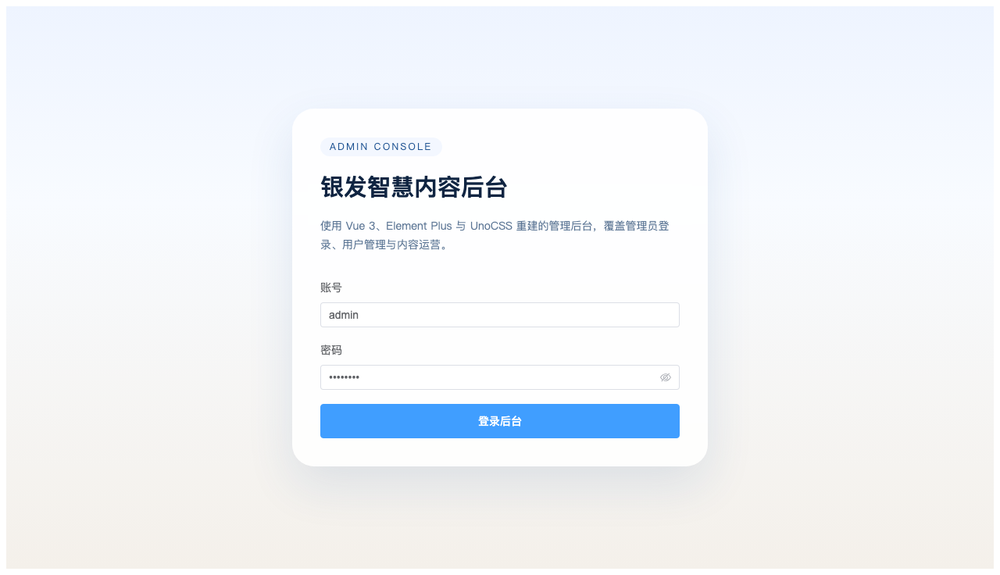
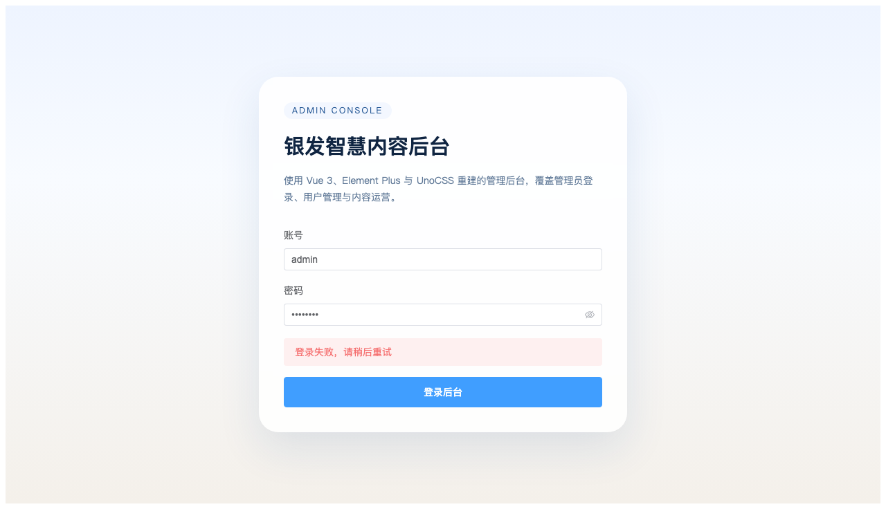

# 银发智慧内容管理后台 - 登录功能验证

## 测试环境
- 前端地址: http://localhost:5173
- 后端网关: http://localhost:9000
- 测试账号: admin / admin123

---

## 1. 登录页面



---

## 2. 登录成功 - 仪表盘



---

## 测试结果

| 功能 | 状态 | 说明 |
|------|------|------|
| 登录页面加载 | ✅ | 页面正常显示 |
| 默认账号填充 | ✅ | admin/admin123 已填入 |
| 登录功能 | ✅ | 点击按钮后成功跳转 |
| 仪表盘显示 | ✅ | 用户管理页面正常加载 |

---

## 后端 API 验证

```bash
# 登录接口测试
curl -X POST http://localhost:9000/api/user/admin/auth/login \
  -H "Content-Type: application/json" \
  -d '{"username":"admin","password":"admin123"}'

# 响应
{"code":200,"message":"success","data":{"token":"xxx","adminId":1,"name":"系统管理员","loginType":"admin"}}
```

---

*验证时间: 2026-04-29 14:10*
